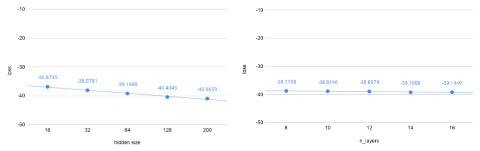
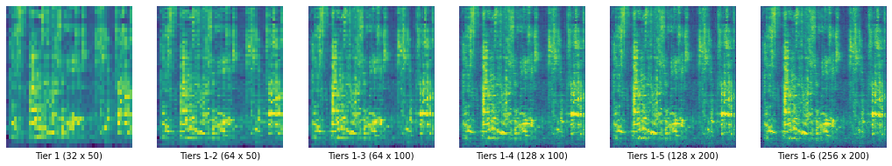

# MelNet: PyTorch implementation

This project is a PyTorch implementation of [S. Vasquez and M. Lewis, “Melnet: A generative model for audio in the frequency domain”](https://arxiv.org/abs/1906.01083) which aims at generating high-fidelity audio samples by using two-dimensional time-frequency representations (spectrograms) in conjunction with a highly expressive probabilistic model and multiscale generation procedure.
 
For a more complete description than the one found in this README of MelNet, this implementation and  the results achieved, please see the [Report](MelNet_Report.pdf) or the [Presentation](MelNet_Presentation.pdf) of the project.
 
## Table of contents
1. [Results](#results)
2. [Project Structure](#project-structure)
3. [Setup](#installation)
    1. [Setup with Ananconda](#setup-with-anaconda)
    2. [Setup with Docker](#setup-with-docker)
4. [Usage](#usage)
5. [Description of MelNet](#description-of-melnet)
6. [Notes](#notes)

## Results
### Context
Each model's tiers models were trained individually on a NVIDIA GTX 2080 with 8GB of VRAM. The size of each tier is defined by the number of layers and the hidden size (RNN hidden state size), being hidden size the parameter that affects the size of a tier the most. To be able to fit in the GPU memory, the hidden size of the models had to be reduced to 200 (from the 512 used in the original paper).

To illustrate the architectures of the trained models in a compact way, from now on we will follow this pattern: *d(dataset)_t(number of tiers)_l\[number of layers\]_hd(hidden size)_gmm(GMM Mixture Components)*.

### Initial Results
The first model was trained on a Podcast dataset (dataset containing dialogue-based podcast audios), following the architecture used by [Vasquez and Lewis in MelNet for unconditional speech for 
Blizzard (Table 1)](https://arxiv.org/abs/1906.01083) but with a hidden size of 200 instead of 512 due to memory constraints.


Architecture: dpodcast_t6_l12.5.4.3.2.2_hd200_gmm10. The wav file can be found [here](results/fig6.1_dpodcast_t6_l12.5.4.3.2.2_hd200_gmm10.wav).

The Upsampling Layers appear to be able to add detail to the spectrogram generated by previous tiers, but the initial tier was not able to dictate a coherent high-level structure. 

### Experiments with Upsampling Layers Only
As a means to see how much impact the initial tier has in the final spectrogram, we modified the algorithm for synthesis. In the normal synthesis algorithm, the first tier generates unconditionally a low-resolution spectrogram and the upsampling tiers add detail. In the modified synthesis algorithm, the first tier is an item from the dataset (a low-resolution spectrogram) and only the upsampling layers are used to add detail.
 


Architecture: dljspeech_t6_l0.7.6.5.4.4_hd200_gmm10. The first tier does not have layers because it 
was not used. The wav file can be found [here](results/fig6.2_upsampling-dljspeech_t6_l16.7.6.5.4.4_hd200_gmm10.wav).

### Experiments with First Tier
Knowing that the first tier is important because it dictates the high-level structure of the spectrogram, we compare the impact that the hidden size and the number of layers have on the loss of the firs tier.


Hidden size vs. Loss plot: Architecture: dljspeech_t6_l14.5.4.3.2.2_hdX_gmm10.  
Number of layers vs. Loss plot: Architecture: dljspeech_t6_lX.5.4.3.2.2_hd64_gmm10.

From these results, we can conclude that the parameter hidden size has a greater impact on the loss than the number of layers.

### Final Result
Finally, we trained the biggest model we could, after seeing that the size of the tiers has an impact on the quality of the spectrograms generated.



Architecture: dljspeech_t6_l12.7.6.5.4.4_hd200_gmm10. The wav file can be found [here](results/fig6.6_dljspeech_t6_l12.7.6.5.4.4_hd200_gmm10.wav).

## Project Structure
```
SpeechGeneration-MelNet
|-- assets/           <- images used in the README.md, Report and Presentation
|-- datasets/         <- original data used to train the model (you have to create it)
|
|-- logs/             <- (you have to create it or it will be created automatically)
|   |-- general/      <- logs for general training
|   `-- tensorboard/  <- logs for displaying in tensorboard
|
|-- models/
|   |-- chkpt/     <- model weigths for different runs stored in pickle format. It stores also the
|   |                 training parameters. (you have to create it or it'll be created automatically)
|   `-- params/    <- description of the parameters to train and do speech synthesis according 
|                     to the paper and the dataset
|
|-- notebooks/     <- Jupyter Notebooks explaining different parts of the data pipeline 
|                     or the model
|
|-- results/       <- spectrograms, waveforms and wav files synthesized from trained models
|
|-- src/                  <- source code for use in this project
|   |-- data/             <- scripts to download and load the data
|   |-- dataprocessing/   <- scripts to turn raw data into processed data to input to the model
|   |-- model/            <- scripts of the model presented in the paper
|   |-- utils/            <- scripts that are useful in the project
|   |-- synthesis.py      <- main program to perform synthesis (see Usage section)
|   `-- train.py          <- main program to perform training (see Usage section)
|
|-- utils/                <- files for running the model in Docker
|
|-- environment.yml      <- file for reproducting the environment (created with anaconda)  
`-- Makefile             <- file with commands to run the project without effort
```

## Setup 
### Setup with Anaconda
0. Download and install [Anaconda](https://www.anaconda.com/)
1. Clone the [source code](https://github.com/jgarciapueyo/MelNet-SpeechGeneration) with git:
```
git clone https://github.com/jgarciapueyo/MelNet-SpeechGeneration
cd MelNet-SpeechGeneration
```
2. Prepare the environment with Anaconda and activate it
```
conda create --name melnet -f environment.yml
conda activate melnet
```

### Setup with Docker
0. Download and install [Docker](https://docs.docker.com/get-docker/)
1. Clone the [source code](https://github.com/jgarciapueyo/MelNet-SpeechGeneration) with git:
```
git clone https://github.com/jgarciapueyo/MelNet-SpeechGeneration
cd MelNet-SpeechGeneration
```

2. Create the image
```
docker build -f utils/docker/Dockerfile -t melnet .
```  
or ```make build-container```  

3. Run the container
```
docker run -it --rm --gpus all --mount src="$(pwd)",target=/app,type=bind melnet
```
or ```make run-container```

## Usage
### Training
0. Set up the project following the instructions in [Setup](#setup).
1. Download a dataset in the folder `datasets/`. As an example, the datasets [Librispeech](http://www.openslr.org/12) and [LJSpeech](https://keithito.com/LJ-Speech-Dataset/) can 
be downloaded by running
```
make data-librispeech
make data-ljspeech
```

2. Create a YAML file for training a complete model (several tiers) on a dataset. This YAML will contain information about the architecture of the model and other parameters needed when transforming the audio waveforms of the dataset into melspectrograms. More information about the structure of the training YAML files can be found [here](models/params/README.md).
3. Train your MelNet model
```
python src/train.py -p models/params/{dataset}/{training_config_file}.yml
```
More options for training a model can be found [here](src/train.py), like resuming training or specifying the tier/tiers of the model to be trained.  
When training a model, it will automatically create a log file `logs/general/{modelarchitecture}/{tier}_{timestamp}`, a folder for tensorboard files `logs/tensorboard/{modelarchitecture}_{timestamp}_{tier}/` and a folder for the weights of the model `models/chkpt/{modelarchitecture}/` (each tier is stored separately in pickle format using *.pt* file extension).

### Synthesis
After having trained a complete model (all the tiers), you can generate unconditionally spectrograms:
1. Create a YAML file for performing synthesis. This YAML will contain information about the path to the weights of the tiers and the output folder. More information about the synthesis YAML file can be found [here](models/params/README.md).
2. Generate spectrograms
```
python src/synthesis.py -p models/params/{dataset}/{training_config_file}.yml -s models/params/{dataset}/{synthesis_config_file}.yml -t {timesteps_spectrogram}
```
When synthesizing a spectrogram, it will stored the spectrogram as an image and as a tensor in the path specified in the synthesis YAML file. It will save it in the tensorboard format in `logs/tensorboard/{modelarchitecture}_{timestamp}_{tier}/` and create a log file `logs/general/{modelarchitecture}/synthesis_{timestamp}`.

## Description of MelNet
\# TODO  
A complementing description to the original paper can be found in the [Report](MelNet_Report.pdf) of the project, adding new figures which can help understanding MelNet architecture.

## Notes
This project is part of the course [DD2465 Advanced, Individual Course in Computer Science](https://www.kth.se/student/kurser/kurs/DD2465?l=en)
during my studies at [KTH](https://www.kth.se/en).